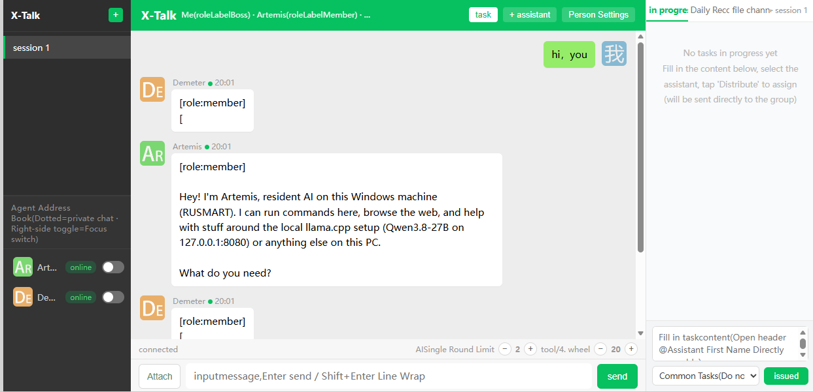
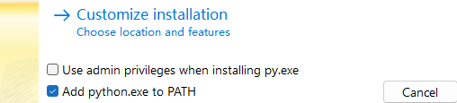

# X-Talk



X-Talk is a local multi-agent group chat app. It lets a human user chat with one or more LLM agents in the same conversation. Agents can use local or remote command execution when configured.

## Local Quick Start

This is the standard deployment path for normal users.

### 1. Install Python

Install Python 3.10 or newer from https://python.org.

During installation, check:

```text
Add Python to PATH
```



### 2. Run Setup

Double-click:

```text
setup.bat
```

This will:

- create a local `.venv` virtual environment
- install Python dependencies
- create `config.json` from `config.example.json` if `config.json` does not exist

### 3. Configure Your Model

Edit:

```text
config.json
```

Set at least:

```json
{
  "name": "Artemis",
  "type": "openai",
  "model": "your-model-name",
  "base_url": "http://127.0.0.1:8080/v1",
  "executor": {
    "type": "local"
  },
  "enabled": true,
  "role": "member"
}
```

`base_url` must point to an OpenAI-compatible endpoint ending in `/v1`.

Examples:

```text
http://127.0.0.1:8080/v1
http://127.0.0.1:1234/v1
http://127.0.0.1:11434
```

### 4. Start X-Talk

Double-click:

```text
start.bat
```

The browser opens:

```text
http://127.0.0.1:8321
```

### 5. Stop X-Talk

Double-click:

```text
stop.bat
```

## Verify

With X-Talk running, open PowerShell in the project folder and run:

```powershell
Invoke-RestMethod http://127.0.0.1:8321/api/members
Invoke-RestMethod -Method Post http://127.0.0.1:8321/api/presence/probe
```

Expected:

- `/api/members` returns `group_name: "X-Talk"`.
- `/api/presence/probe` returns `ok: true`.
- A member with a reachable model endpoint shows `presence_status: "online"`.

## Common Issues

### Python not found

Install Python and make sure `Add Python to PATH` is checked.

### Port 8321 already in use

Run:

```powershell
Get-NetTCPConnection -LocalPort 8321 -State Listen
```

Then stop the old X-Talk window or run:

```powershell
.\stop.bat
```

### Model endpoint not reachable

Check the model service:

```powershell
Invoke-RestMethod http://127.0.0.1:8080/v1/models
```

Replace the URL with your actual `base_url` plus `/models`.

### Member shows offline

Check:

- the model endpoint is running
- `base_url` is correct
- the endpoint ends in `/v1` for OpenAI-compatible servers
- the model name matches the endpoint

## Optional LAN Mode

By default, `start.bat` binds to:

```text
127.0.0.1
```

To allow other computers on your LAN to open X-Talk, start manually:

```powershell
$env:HOST="0.0.0.0"
$env:PORT="8321"
.\.venv\Scripts\python.exe server.py
```

Then open:

```text
http://YOUR_PC_IP:8321
```

Only do this on a trusted network.

## Optional Remote Agent

If an agent should execute commands on another computer, run `pc_agent.py` on that computer:

```powershell
python pc_agent.py
```

Then set the member executor:

```json
{
  "executor": {
    "type": "remote",
    "url": "http://REMOTE_IP:8931"
  }
}
```

## Security

- Do not expose port `8321` to the public internet.
- Do not expose port `8931` to the public internet.
- Keep `config.json` private if it contains LAN addresses or API key environment names.
- Use `api_key_env` instead of writing API keys directly into `config.json`.

## License

This project is licensed under the MIT License. See `LICENSE` for details.

Author: Xperrate  
Date: 2026-10

## More Details

See `DEPLOYMENT.md` for the full local deployment guide.
